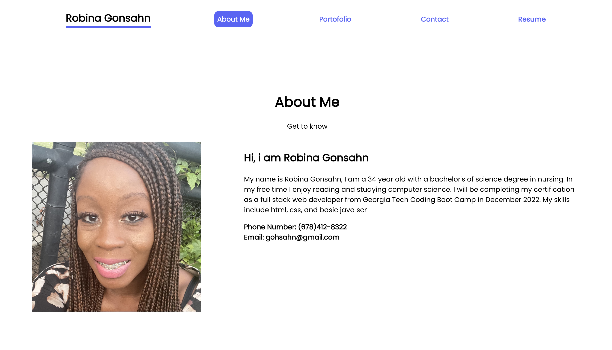

# React-Portfolio

## Description 
A developer portfolio built with react, used to showcase my projects.

## Built with 
"@testing-library/jest-dom": "^5.16.5",
    "@testing-library/react": "^13.4.0",
    "@testing-library/user-event": "^13.5.0",
    "react": "^18.2.0",
    "react-dom": "^18.2.0",
    "react-scripts": "5.0.1",
    "web-vitals": "^2.1.4" 
    
    ## Table of Contents
  - [Installation](#installation)
  - [Usage](#usage)
  - [Tests](#tests)
  - [Questions](#questions) 

  ## Installation 
  install all dependencies by running the following code from the root folder:
  `npm install` 

  ## Usage 
  To open application in browser run the following command from terminal:
  `npm start` 

  ## Test 
  React testing library automatically renders when app is running. 

  ## Questions 
  [rgonsahn](https://github.com/rgonsahn)
 <a href="mailto:rgonsahn@yahoo.com">mail link</a> 

 

